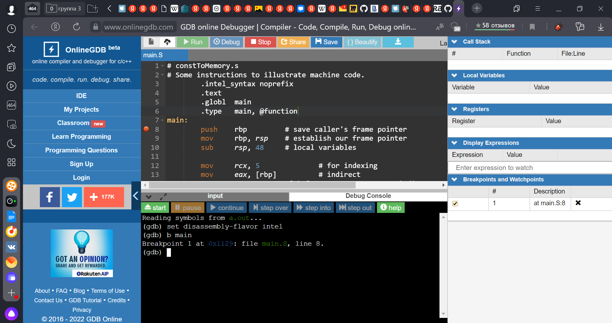
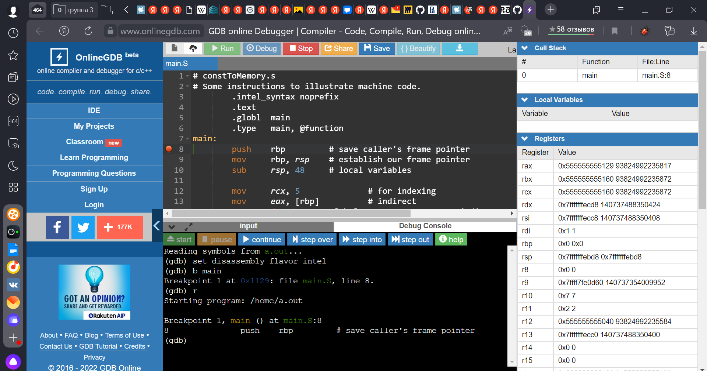
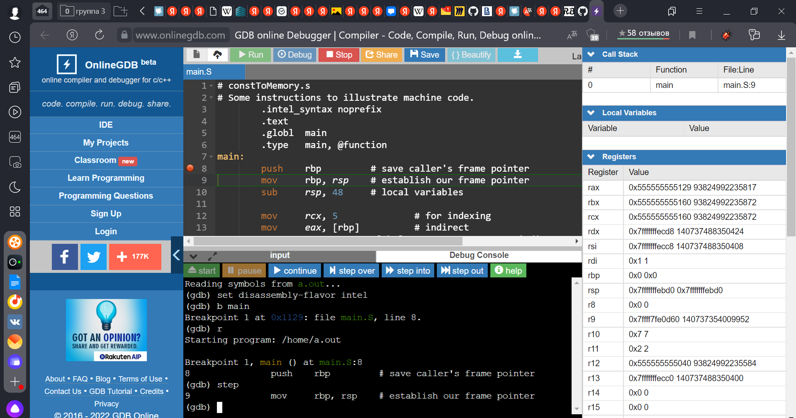
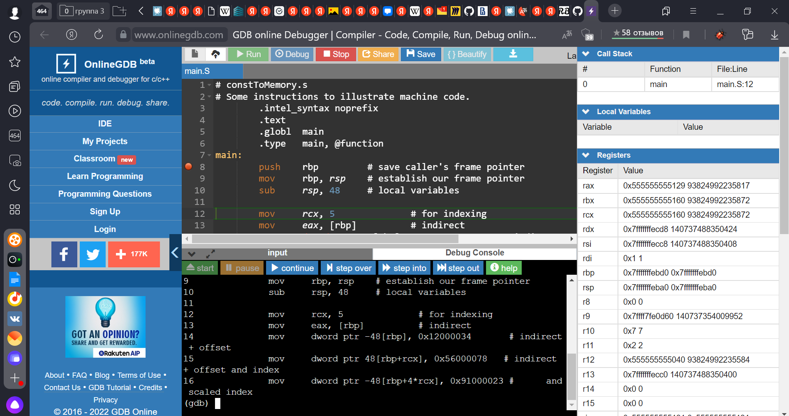
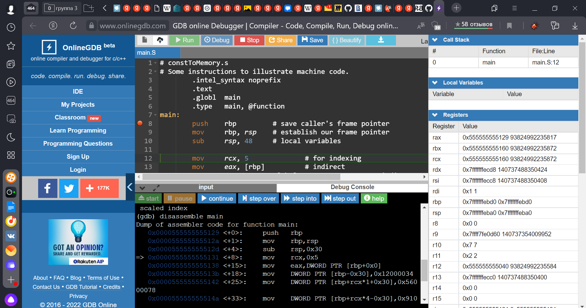
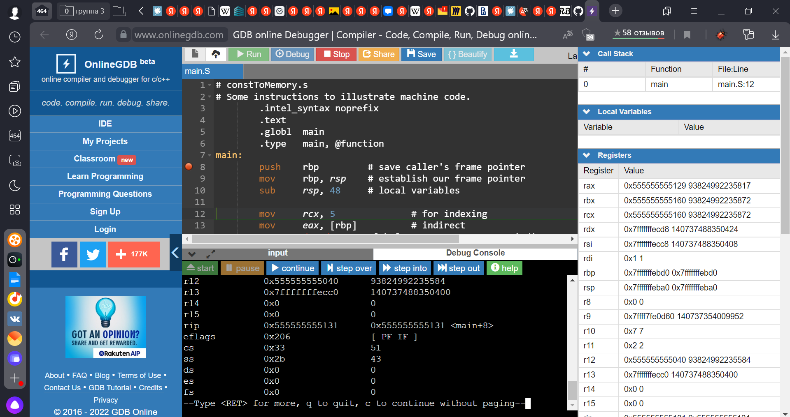
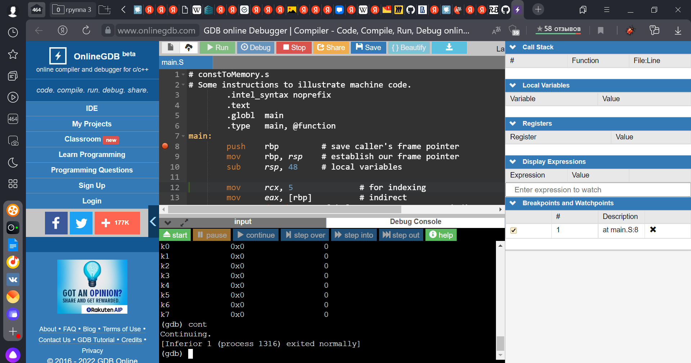

Отчет отладки по программе 04-constToMemory
===

Четвертая программа была отлажена с помощью OnlineGDB 

Отладка:

Очень удобная отладка с помощью этого инструмента:
* справа сразу записаны все регистры, функции, локальные переменные
* виден проход по коду с помощью зеленой обводки